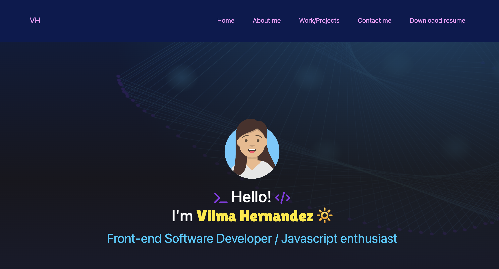

# bootstrap-portfolio
A basic portfolio created with Bootstrap

## Description

A very basic Portfolio created for Front-end Developer Bootcamp EDX challenge and homework with the purpose of learning to code.
Very basic website created with Bootstrap and some customised CSS/HTML

## Usage

Link to deployed page
https://vilmaglynn.github.io/bootstrap-portfolio/

## License
MIT License

Copyright (c) 2023 Vilma Hernandez
